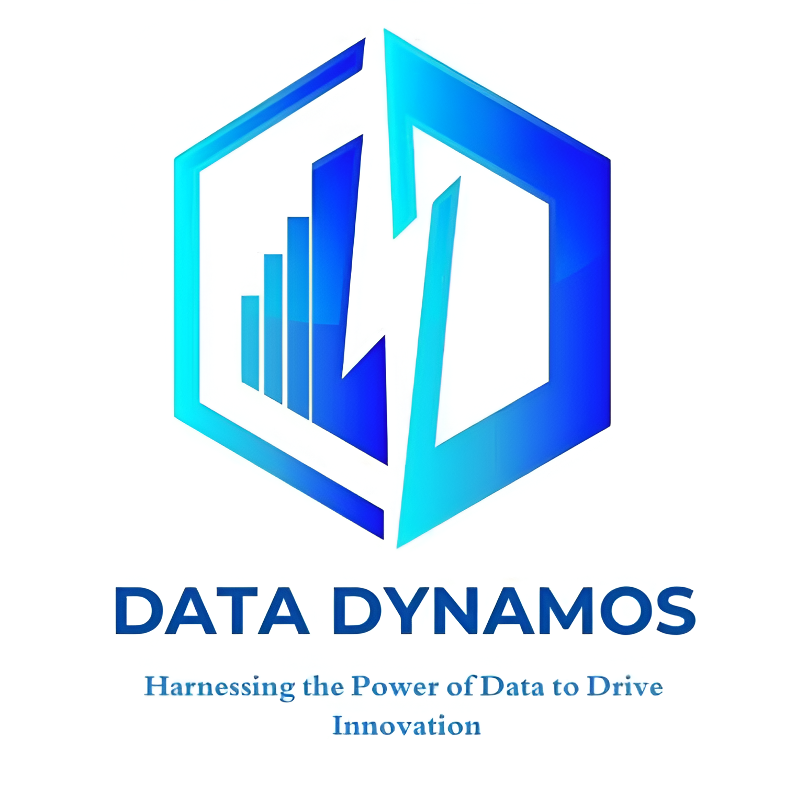

# Human Resources Data Dynamos Project



## Table of Contents

1. [Overview](#overview)
2. [Key Features](#key-features)
3. [Repository Structure](#repository-structure)
4. [Getting Started](#getting-started)
5. [Phase Details](#phase-details)
6. [Project Workflow](#project-workflow)
7. [Contributing](#contributing)
8. [License](#license)

---

## Overview

The **Human Resources Data Dynamos** project delivers an end-to-end analytics pipeline for HR data, transforming raw employee information into data-driven insights useful for decision-makers. This repository includes everything from SQL scripts and Python notebooks to BI dashboards and strategic reports.

## Key Features

* **Modular Phases**: Organized into 13 clear, sequential phases covering data collection through reporting.
* **Reproducibility**: Environment defined in `requirements.txt`, with setup scripts and instructions.
* **Multi-Tool Stack**: Utilizes SQL, Python (pandas, scikit-learn), Jupyter notebooks, Tableau, Power BI, and standard office docs.
* **Deliverables**: Cleaned datasets, visualizations, predictive models, and formal presentations.

## Repository Structure

```text
├── assets                     # Branding: team logo, images
├── DataSet                    # Raw HR data (Excel, CSV, archives)
├── Instructions               # Guides, proposals, PDFs, member info
├── Project-Operations         # Core analysis pipeline
│   ├── 01.Data-Collection     # Raw CSV exports of source tables
│   ├── 02.Data-Wrangling      # Transformation specs and scripts
│   ├── 03.Data-Cleaning       # Cleaned data snapshots + SQL scripts
│   ├── 04.Data-Exploration&Transformation  # EDA outputs & business questions
│   ├── 05.Data-Modeling       # ER diagrams and logical models
│   ├── 06.Data-Analysis       # Jupyter notebooks and detailed PDF report
│   ├── 07.Data-Forecasting    # Forecasting notebooks and code
│   ├── 08.Data-Visualization  # Tableau (.twbx) & Power BI dashboards
│   ├── 09.Data-Mining         # Clustering, association, and mining outputs
│   ├── 10.Data-Driven-Decision-Making # Strategic frameworks (SWOT, PESTEL, etc.)
│   ├── 11.Reporting           # Annual and management report drafts & finals
│   ├── 12.Application         # Proposal templates and Excel macros
│   └── 13.Presentation        # Stakeholder slide decks
├── LICENSE
├── README.md                  # This document
└── requirements.txt           # Python package dependencies
```

## Getting Started

Follow these steps to replicate our environment and explore the analysis:

1. **Clone the repo**

   ```bash
   git clone https://github.com/0PeterAdel/Data-Dyanamos.git
   cd Data-Dyanamos
   ```

2. **Create a virtual environment**

   * Windows:

     ```bash
     python -m venv env
     env\Scripts\activate
     ```
   * Linux/macOS:

     ```bash
     python3 -m venv env
     source env/bin/activate
     ```

3. **Install dependencies**

   ```bash
   pip install -r requirements.txt
   ```

4. **Set up database (optional)**

   * Load `Project-Operations/01.Data-Collection/*.csv` into your SQL engine.
   * Execute SQL scripts in `03.Data-Cleaning` to create cleaned tables.

5. **Run Notebooks**

   * Launch Jupyter:

     ```bash
     jupyter lab
     ```
   * Navigate to `Project-Operations/06.Data-Analysis` and open `analysis-part1.ipynb`, `analysis-part2.ipynb`.

6. **View Dashboards**

   * Tableau: Open `Project-Operations/08.Data-Visualization/Tableau/Data Dynamos Project (Data Forecasting).twbx`.
   * Power BI: Open `Project-Operations/08.Data-Visualization/Power-Bi/Data Dynamos Data Analysis.pbix`.

---

## Phase Details

Below are brief descriptions and key artifacts for each project phase:

### 01. Data Collection

* **Objective**: Gather raw HR tables.
* **Files**: `Employee.csv`, `PerformanceRating.csv`, etc.
* **Outcome**: Baseline CSV exports for import.

### 02. Data Wrangling

* **Objective**: Define transformations (e.g., normalizing codes).
* **Artifacts**: PDF with mapping rules, Python scripts.

### 03. Data Cleaning

* **Objective**: Remove duplicates, handle missing values, enforce types.
* **Scripts**: `Employee.sql`, `PerformanceRating.sql`.
* **Snapshots**: Cleaned CSVs and Excel files in `Data-Cleaned/`.

### 04. Exploration & Transformation

* **Objective**: Perform EDA to surface patterns.
* **Deliverables**: Business-Questions.pdf, KPI definitions.

### 05. Data Modeling

* **Objective**: Design ER diagrams and logical data model.
* **Files**: `Data-Modeling.png` variants, `HR-Data.xlsx` model sheet.

### 06. Data Analysis

* **Objective**: Answer core HR questions via notebooks.
* **Notebooks**:

  * `analysis-part1.ipynb`: Demographics & satisfaction analysis.
  * `analysis-part2.ipynb`: Turnover and performance insights.
* **Report**: `Analysis-Report.pdf` summarizing major findings.

### 07. Data Forecasting

* **Objective**: Build predictive models (e.g., satisfaction, turnover).
* **Code**: `main.ipynb`, `main.py` using scikit-learn.
* **Report**: `Forecast-Report.pdf`.

### 08. Data Visualization

* **Objective**: Create interactive dashboards.
* **Tableau**: `.twbx` and PDF export.
* **Power BI**: `.pbix`, PDF, and PPTX templates.

### 09. Data Mining

* **Objective**: Uncover latent clusters and associations.
* **Outputs**: Excel dashboards, PDF & PPTX slides.

### 10. Data-Driven Decision Making

* **Objective**: Apply strategy frameworks.
* **Frameworks**: PESTEL, SWOT, SOAR, TOWS, VRIO.
* **Artifacts**: Each has paired PDF and Excel workbook.

### 11. Reporting

* **Objective**: Consolidate insights into reports.
* **Reports**: Annual HR report, Management reports across functions.

### 12. Application

* **Objective**: Provide templates for client proposals.
* **Files**: Proposal docs (`.docx`/`.pdf`), Excel-based macros.

### 13. Presentation

* **Objective**: Stakeholder slide decks summarizing project.
* **Formats**: PPTX templates ready for customization.

---

## Project Workflow

1. **Collect & Clean**: Import raw CSVs → run SQL cleaning → export cleaned tables.
2. **Explore**: Run EDA notebooks → define business questions.
3. **Model & Forecast**: Build data models → train predictive models.
4. **Visualize**: Develop dashboards in Tableau/Power BI.
5. **Report & Present**: Compile insights into formal reports and slide decks.

---

## Contributing

1. **Fork** and create a branch: `git checkout -b feature/XYZ`
2. **Commit**: `git commit -m "Add feature XYZ"`
3. **Push**: `git push origin feature/XYZ`
4. **Submit** a Pull Request for review.

Please follow our coding standards and document any major changes in `CHANGELOG.md` (create one if needed).

---

## License

This project is licensed under the Apache License 2.0. See [LICENSE](LICENSE) for details.

<p align="center">
  
</p>

